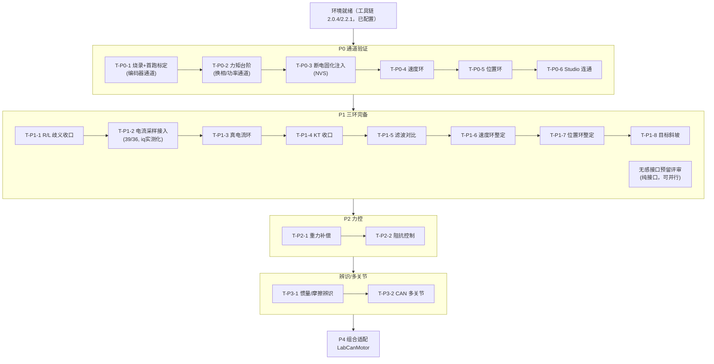

# 测试流程与顺序（门禁式推进）

> 状态：已对齐 ｜ 文档编号：SPEC-T
> 最后对齐：2026-09-17（立项）｜ 上游：SPEC-P（验收条目）、ARC-01（架构）
> 定位：回答"**先测什么、后测什么、为什么**"。验收判据在 SPEC-P，执行顺序与门禁规则在本文。执行序 ≠ SPEC-P 条目编号。

---

## 1. 排序原则（五先五后 + 门禁）

1. **先开环后闭环**：功率/换相/传感器通道先用开环与标定验证，再谈闭环；
2. **先内环后外环**：电流环 → 速度环 → 位置环，内环不稳整定外环无意义（外环会把内环的病当成自己的病）；
3. **先建模计算后微调（计算优先）**：整定第一动作永远是建模与带宽计算——建模 → 取标称 → 选带宽 → 公式算增益 → 上机在计算值附近微调 → 抄回。**参数来源优先级：① 官方标称 → ② 辨识（本平台仅交叉验证与未知量收口）→ ③ 反推估算（须标注来源）**。理由：非高精度系统；辨识设备受限（精度可能反不如厂家标称）；辨识方法论已在实验室底层双环系统验证（能力已证明）——本平台标称优先，忽略批次/型号差异；
4. **先空载后加载**：所有新功能空载验证后，加载实验另立条目；
5. **先静态后动态**：零偏/标度/零位等静态量先过，再做阶跃/斜坡等动态指标。

**门禁**：每步设通过门；过门才进下一步。已过门步骤出现行为回归（复测异常）= 立即停线排查，视同当前步失败。

## 2. 全局测试依赖图

## 3. P0 执行序列（通道验证）

| 步骤 | 内容 | 前置 | 通过门 | 失败排查方向 | 产物 |
|---|---|---|---|---|---|
| T-P0-1 | 烧录示例 01，观察首跑标定 | 接线检查：12V 供电、编码器接 M0 口（19/18）、相线对应 | 标定动作正常（转子小幅转动后静止），打印"标定已固化"，无 I2C/FOC 错误 | I2C 报错→编码器接线/总线；标定失败→相线序 | 验收报告（串口日志） |
| T-P0-2 | 力矩台阶 = P0-② | T-P0-1 过门 | ±0.01 N·m 方向随符号切换、幅度对称、1 分钟仅温热 | 完全不转→换相/电压通道；方向不对→重标定 | 报告 + stream 数据 |
| T-P0-3 | 断电重启注入 = P0-④ | T-P0-2 过门 | 重启打印"注入历史标定"、无标定动作，力矩行为与首烧一致 | 行为不一致→NVS 写入/注入路径 | 两段日志对比 |
| T-P0-4 | 速度环 = P0-③ | T-P0-3 过门 | 5 rad/s 稳态误差 ≤5%，无持续振荡 | 振荡→降增益重试；仍不过→速度反馈质量（LPF Tf），挂账转 P1 | 报告 + 数据 |
| T-P0-5 | 位置环 = P0-⑦ | T-P0-4 过门 | 0↔π 阶跃收敛（稳态 ±0.1 rad 内），无持续超调/振荡 | 发散/振荡→先降位置增益；确认速度环健康（回跑 T-P0-4） | 报告 + 数据 |
| T-P0-6 | Studio 连通 = P0-⑥ | T-P0-5 过门 | Studio 连接出曲线，在线改增益即时生效 | 连不上→串口占用/波特率；改参无效→会话未进入 | 报告（截图） |

## 4. P1 执行序列（三环完备）

| 步骤 | 内容 | 前置 | 通过门 |
|---|---|---|---|
| T-P1-1 | R/L 验证性确认：万用表测线间电阻对表官方（相 8.25Ω/线间 16.5Ω/相感 4.25mH 已官方闭环） | P0 全过 | 线间实测 ≈16.5Ω 偏差 <±10%；异常则登记排查（接线/温漂） |
| T-P1-2 | 板载电流采样接入：适配层挂 InlineCurrentSense（M0: 39/36，0.01Ω×50V/V），iq 估算→实测 | T-P1-1 | 零偏合理；静态电流读数与 U/R 估算同量级 |
| T-P1-3 | 真电流环：力矩通道切实测电流模式，电流阶跃（如 0.2→0.5A） | T-P1-2 | 阶跃跟随、稳态误差达标（阈值立项时定）；iq 全链路实测 |
| T-P1-4 | KT 收口：用实测电流做力矩-电流标定 | T-P1-3 | 实测 KT 落公式初值 0.0827 N·m/A 的 ±20% 带内，或给出修正依据并更新 bsp |
| T-P1-5 | 速度估计滤波对比：Tf 扫描（0.005/0.01/0.02/0.05） | T-P1-3 | 有数据支撑的 Tf 建议写入配置并注明来源 |
| T-P1-6 | 速度环整定方法论：增益从参数推→验证→复现 | T-P1-5 | 阶跃指标（建立时间/超调）达标且两轮复现 |
| T-P1-7 | 位置环整定（外环，内环增益冻结） | T-P1-6 过门 | 阶跃超调可整定并复现 |
| T-P1-8 | 目标斜坡（梯形速度曲线） | T-P1-7 | 斜坡跟踪误差达标（阈值立项时定） |
| （并行） | 无感接口预留评审 | P0 全过 | 契约层预留位评审通过（纯接口，不占硬件序） |

> **2026-09-17 更新**：T-P1-2 代码就绪（`SimpleFocMotor` 默认接入板载电流采样，M0: 39/36、M1: 35/34，均 15/16 课例程真值），待上板验证。本节剧本的**载体程序** = `examples/FocKit_05_loop_tuning`：建模带宽计算区（开机即算即打印）、`loop v|p|i` 一键进会话、`step` 自动方波激励、`gains` 复看计算值。

## 5. P2~P4 执行序列（草稿，立项时细化）

| 步骤 | 内容 | 前置 | 通过门 |
|---|---|---|---|
| T-P2-1 | 重力补偿 | P1 全过（KT 已收口、力矩通道带宽已知） | 前馈开启后位置环稳态误差显著减小 |
| T-P2-2 | 阻抗控制 | T-P2-1 | 刚度/阻尼参数可整定，接触稳定 |
| T-P3-1 | 惯量/摩擦辨识（STM32 方法论迁移） | P1 全过 | 两种激励法交叉验证一致 |
| T-P3-2 | CAN 多关节 | 单关节全栈（P1+P2）稳定 | 多关节协同基础功能 |
| T-P4-1 | LabCanMotor 组合适配 | P1~P3 算法资产冻结 | P0~P3 条目在新平台复跑通过，上层代码零改动 |

## 6. 跨阶段纪律

1. **门禁推进**：当前步不过门，禁止进下一步；过门步骤行为回归 = 停线；
2. **隔离归因**：上层测试失败，**禁止改底层**（适配层参数/标定/内环增益）来"救"上层指标——先回跑最近通过门的用例证明底层通道健康，再查上层；
3. **单变量**：一次实验只动一个变量（增益/滤波/目标），动前记录基线；
4. **落盘**：每步产物必须落 `06_验证与实验记录/`；成案排查转 `调试日志/` 立经验帖（本项目经验帖独立计数）；
5. **回退规则**：失败 → 回退到最近通过门，从该步"失败排查方向"入手，不做无假设的随机试错。

## 7. 与 SPEC-P 的关系

- SPEC-P 是**验收合同**（判据/阈值/记录位置），SPEC-T 是**执行规程**（顺序/依赖/门禁/回退）；
- 状态回填按 SPEC-P 条目编号（P0-①~⑦），执行按本文 T 步骤序；
- 本轮 SPEC-P 已同步补齐 P0-⑦（位置环）与 P1 电流环条目，消除"有测试无判据"缺口。
